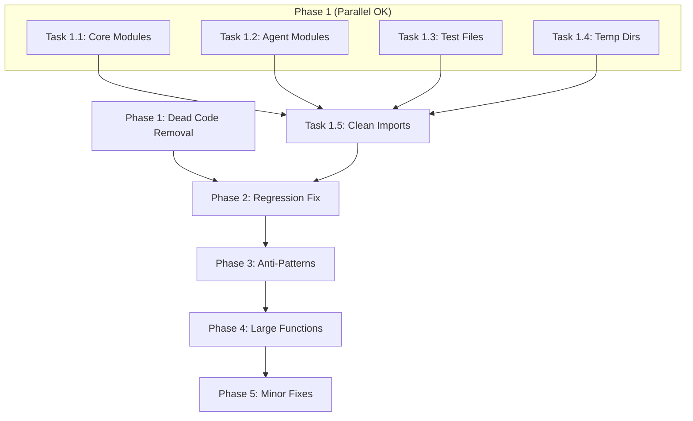

# Subagent Execution Plan - Code Cleanup & Quality Fixes

**Created**: 2026-01-11
**Track**: dead_code_removal_20260111
**Execution Method**: subagent-driven-development
**TDD Required**: YES - All tasks follow test-driven-development workflow

---

## Overview

This plan contains **independent, atomic tasks** that lower-capability LLMs can execute via subagent dispatch. Each task:

1. Has clear acceptance criteria
2. Follows TDD (test first, then implement)
3. Can be verified independently
4. Includes rollback instructions

> [!IMPORTANT]
> **Orchestrator Instructions**: Dispatch one subagent per task. After each task completion, run spec review then code quality review before proceeding.

---

## Phase 1: Dead Code Removal (No Tests Needed)

These tasks delete unused code. No TDD required - just verify no imports break.

### Task 1.1: Delete Dead Core Modules

**Files to Delete**:
```
core/abstract_first_extractor.py
core/pubmed_fetcher.py
core/auto_corrector.py
core/validation_rules.py
core/self_consistency.py
```

**Steps**:
1. Run `grep -r "abstract_first_extractor\|pubmed_fetcher\|auto_corrector\|validation_rules\|self_consistency" --include="*.py" . | grep -v "test_" | grep -v ".pyc"` to verify no production imports
2. Delete each file with `git rm`
3. Run `pytest tests/ -v --tb=short` to verify nothing breaks
4. Commit: `git commit -m "chore: Delete 5 unused core modules (~3,600 LOC)"`

**Acceptance Criteria**:
- [ ] All 5 files deleted
- [ ] No `ImportError` when running tests
- [ ] All existing tests still pass

**Rollback**: `git checkout HEAD -- core/abstract_first_extractor.py core/pubmed_fetcher.py core/auto_corrector.py core/validation_rules.py core/self_consistency.py`

---

### Task 1.2: Delete Dead Agent Modules

**Files to Delete**:
```
agents/researcher_analysis.py
agents/conflict_resolver.py
agents/section_locator.py
```

**Steps**:
1. Run `grep -r "researcher_analysis\|conflict_resolver\|section_locator" --include="*.py" . | grep -v "test_"` to find imports
2. Remove unused imports from `core/hierarchical_pipeline.py` (lines 38-39)
3. Delete agent files with `git rm`
4. Run `pytest tests/ -v --tb=short`
5. Commit: `git commit -m "chore: Delete 3 unused agent modules"`

**Acceptance Criteria**:
- [ ] All 3 agent files deleted
- [ ] Unused imports removed from hierarchical_pipeline.py
- [ ] All tests pass

---

### Task 1.3: Delete Dead Test Files

**Files to Delete**:
```
tests/test_abstract_first.py
tests/test_two_pass_gemini.py
tests/test_two_pass_premium.py
```

**Steps**:
1. Verify these test dead code: `head -20 tests/test_abstract_first.py`
2. Delete with `git rm`
3. Run `pytest tests/ -v` to verify test suite still works
4. Commit: `git commit -m "chore: Delete 3 orphaned test files"`

**Acceptance Criteria**:
- [ ] All 3 test files deleted
- [ ] Test collection still works
- [ ] No test count regression on active tests

---

### Task 1.4: Delete Temporary Directories

**Directories to Delete**:
```
temp_healy/
```

**Steps**:
1. `rm -rf temp_healy/`
2. `git add -A && git commit -m "chore: Remove temporary test directory"`

**Acceptance Criteria**:
- [ ] Directory removed
- [ ] No broken file references

---

### Task 1.5: Clean Unused Imports in hierarchical_pipeline.py

**Imports to Remove** (after dead code deletion):
- Line 25: `ExtractionLog`, `ExtractionWarning`
- Line 29: `AbstractFirstExtractor`, `AbstractExtractionResult`
- Line 30: `PubMedFetcher`

**Instantiations to Remove**:
- Lines 125-126: `self.abstract_extractor = AbstractFirstExtractor()`
- Line 126: `self.pubmed_fetcher = PubMedFetcher()`

**Steps**:
1. View file: `view_file core/hierarchical_pipeline.py lines 1-50`
2. Remove dead imports
3. Remove dead instantiations in `__init__`
4. Run `pytest tests/ -v`
5. Commit: `git commit -m "refactor: Remove unused imports from hierarchical_pipeline"`

**Acceptance Criteria**:
- [ ] No references to deleted modules
- [ ] All tests pass
- [ ] `python -c "from core.hierarchical_pipeline import HierarchicalExtractionPipeline"` succeeds

---

## Phase 2: Critical Regression Fix (TDD Required)

### Task 2.1: Restore RegexExtractor Integration

**Context**: RegexExtractor works (tests pass) but integration was accidentally deleted.

**TDD Steps**:

**RED - Write failing test first**:
```python
# tests/test_regex_tier_zero.py
def test_pipeline_uses_regex_extractor():
    """Verify RegexExtractor is called in pipeline."""
    pipeline = HierarchicalExtractionPipeline()
    assert hasattr(pipeline, 'regex_extractor')
    assert pipeline.regex_extractor is not None

def test_regex_results_merged_into_extraction():
    """Verify regex-extracted fields appear in final output."""
    # Create test doc with DOI and year
    text = "DOI: 10.1234/test.2024 Published: 2024"
    # ... test that doi and publication_year are in result
```

**GREEN - Restore integration**:
1. Add import: `from .regex_extractor import RegexExtractor, RegexResult`
2. Add in `__init__`: `self.regex_extractor = RegexExtractor()`
3. Add Tier 0 extraction before LLM call in `extract_document`:
   ```python
   # Tier 0: Regex extraction
   regex_results = self.regex_extractor.extract_all(context)
   pre_filled = {r.field_name: r.value for r in regex_results.values()}
   ```
4. Merge regex results into final output

**Verification**:
```bash
pytest tests/test_regex_tier_zero.py -v
pytest tests/test_regex_extractor.py -v
```

**Acceptance Criteria**:
- [ ] New test passes
- [ ] Existing regex tests still pass
- [ ] DOI/year extracted via regex appear in pipeline output

---

### Task 2.2: Add pre_filled_fields Support to StructuredExtractor

**Context**: LLM extractor needs to know which fields were pre-filled by regex.

**TDD Steps**:

**RED**:
```python
# tests/test_extractor_prefilled.py
def test_extractor_accepts_prefilled_fields():
    """Verify extractor can receive pre-filled fields."""
    extractor = StructuredExtractor()
    pre_filled = {"doi": "10.1234/test", "publication_year": "2024"}
    # ... verify pre_filled fields are in prompt
```

**GREEN**:
1. Add `pre_filled_fields: Optional[Dict[str, Any]] = None` parameter to `extract_with_evidence`
2. If pre_filled_fields provided, add to system prompt: "The following fields have been pre-extracted: {fields}. Do not re-extract these unless you find conflicting information."
3. Merge pre_filled into final result

**Acceptance Criteria**:
- [ ] New parameter accepted
- [ ] Pre-filled fields appear in LLM prompt
- [ ] Pre-filled fields preserved in output

---

## Phase 3: Code Quality - Anti-Patterns (TDD Required)

### Task 3.1: Centralize os.getenv() Calls

**Issue**: 15+ locations use `os.getenv()` directly instead of settings.

**TDD Steps**:

**RED**:
```python
# tests/test_config_centralization.py
def test_no_direct_getenv_in_core():
    """Verify core/ files don't use os.getenv directly."""
    import subprocess
    result = subprocess.run(
        ["grep", "-r", "os.getenv", "core/", "--include=*.py"],
        capture_output=True, text=True
    )
    # Only config.py should have os.getenv
    lines = [l for l in result.stdout.split('\n') if l and 'config.py' not in l]
    assert len(lines) == 0, f"Found os.getenv outside config.py: {lines}"
```

**GREEN**:
1. Add missing settings to `core/config.py`:
   ```python
   OPENROUTER_API_KEY: str = os.getenv("OPENROUTER_API_KEY", "")
   OLLAMA_MODEL: str = os.getenv("OLLAMA_MODEL", "llama3.1:8b")
   # etc.
   ```
2. Replace `os.getenv()` calls with `settings.SETTING_NAME`

**Files to Update**:
- `core/extractor.py` (lines 95, 102-104)
- `core/client.py` (lines 188, 222)
- `agents/*.py` (various)

**Acceptance Criteria**:
- [ ] Only `config.py` contains `os.getenv`
- [ ] All tests pass
- [ ] Application still starts correctly

---

### Task 3.2: Replace Magic Numbers with Constants

**Issue**: Hardcoded timeouts and retry counts.

**TDD Steps**:

**RED**:
```python
# tests/test_constants_defined.py
def test_client_constants_exist():
    from core.client import (
        OLLAMA_HEALTH_CHECK_TIMEOUT,
        PROCESS_KILL_GRACE_PERIOD,
        OLLAMA_RESTART_MAX_ATTEMPTS
    )
    assert OLLAMA_HEALTH_CHECK_TIMEOUT == 2.0
```

**GREEN**:
Add to `core/client.py`:
```python
# Constants
OLLAMA_HEALTH_CHECK_TIMEOUT = 2.0
PROCESS_KILL_GRACE_PERIOD = 1.0
OLLAMA_RESTART_POLL_INTERVAL = 2.0
OLLAMA_RESTART_MAX_ATTEMPTS = 5
```

Replace usages:
- Line 29: `timeout=2.0` → `timeout=OLLAMA_HEALTH_CHECK_TIMEOUT`
- Line 51: `sleep(1)` → `sleep(PROCESS_KILL_GRACE_PERIOD)`
- etc.

**Acceptance Criteria**:
- [ ] All magic numbers replaced
- [ ] Constants importable
- [ ] All tests pass

---

### Task 3.3: Fix Bare Exception Handling

**Issue**: `except Exception` swallows errors without logging.

**Files**:
- `core/client.py` lines 31-33

**TDD Steps**:

**RED**:
```python
# tests/test_exception_handling.py
def test_client_logs_connection_errors(caplog):
    """Verify connection errors are logged, not swallowed."""
    # ... trigger connection error
    assert "connection" in caplog.text.lower()
```

**GREEN**:
```python
# Before
except Exception:
    return False

# After
except (ConnectionError, TimeoutError) as e:
    logger.warning(f"Ollama health check failed: {e}")
    return False
except Exception as e:
    logger.error(f"Unexpected error in health check: {e}")
    return False
```

**Acceptance Criteria**:
- [ ] Specific exceptions caught
- [ ] Errors logged with context
- [ ] Tests pass

---

## Phase 4: Code Quality - Large Functions (TDD Required)

### Task 4.1: Extract Validation Logic from extract_document

**Issue**: `extract_document` is 185 lines doing multiple things.

**Target**: Extract recall boost logic into `_apply_recall_boost()` method.

**TDD Steps**:

**RED**:
```python
def test_recall_boost_method_exists():
    pipeline = HierarchicalExtractionPipeline()
    assert hasattr(pipeline, '_apply_recall_boost')
    assert callable(pipeline._apply_recall_boost)
```

**GREEN**:
Extract lines 402-424 from `extract_document` into:
```python
def _apply_recall_boost(
    self,
    check_result: CheckerResult,
    extraction: ExtractionWithEvidence,
    schema: Type[T],
    previous_prompts: List[str]
) -> Tuple[CheckerResult, List[str]]:
    """Check for missing fields and trigger re-extraction if needed."""
    # ... extracted logic
```

**Acceptance Criteria**:
- [ ] New method exists and is called
- [ ] `extract_document` reduced by ~20 lines
- [ ] All tests pass
- [ ] Behavior unchanged

---

### Task 4.2: Extract Caching Logic

**Target**: Extract fingerprinting and caching into separate methods.

**TDD Steps**:

**RED**:
```python
def test_caching_methods_exist():
    pipeline = HierarchicalExtractionPipeline()
    assert hasattr(pipeline, '_get_cached_result')
    assert hasattr(pipeline, '_cache_result')
```

**GREEN**:
Methods already exist (`_compute_fingerprint`, `_check_duplicate`, `_cache_result`) - verify they're used properly.

---

## Phase 5: Minor Fixes (No TDD - Documentation)

### Task 5.1: Add Missing Docstrings

**Files**:
- `core/config.py`: Add docstring to `MODEL_ALIASES`
- `core/client.py`: Add docstring to `_get_client_args`

**Steps**:
1. View file and identify missing docs
2. Add appropriate docstrings
3. Commit: `git commit -m "docs: Add missing docstrings to config and client"`

---

### Task 5.2: Improve Variable Names

**Changes**:
- `core/service.py` line 255: `f` → `csv_file`
- `core/service.py` line 156: `i` → `attempt`

**Steps**:
1. Search and replace with care
2. Run tests
3. Commit: `git commit -m "refactor: Improve variable naming in service.py"`

---

## Execution Order



**Dependencies**:
- Tasks 1.1-1.4 can run in parallel
- Task 1.5 must run after 1.1-1.4
- Phase 2 must complete before Phase 3
- Phase 3-5 can have some parallelism within phases

---

## Verification Checklist (After All Tasks)

```bash
# 1. All tests pass
pytest tests/ -v

# 2. No import errors
python -c "from core.hierarchical_pipeline import HierarchicalExtractionPipeline; print('OK')"

# 3. CLI still works
python cli.py --help

# 4. Metrics
wc -l core/*.py agents/*.py  # Should be ~4000 lines less
```

---

## Success Metrics

| Metric | Before | Target | How to Measure |
|--------|--------|--------|----------------|
| Dead code files | 14 | 0 | `ls core/abstract_first* core/auto_corrector*` etc |
| LOC in project | ~15,000 | ~11,000 | `wc -l core/*.py agents/*.py` |
| os.getenv usages | 15+ | 1 (config.py only) | `grep -r "os.getenv" --include="*.py"` |
| Magic numbers | 6+ | 0 | Manual review |
| Test pass rate | 100% | 100% | `pytest` |

---

## Rollback Plan

If any task fails:
1. `git stash` current changes
2. `git checkout HEAD -- <affected files>`
3. Report issue to orchestrator
4. Do not proceed to next task
